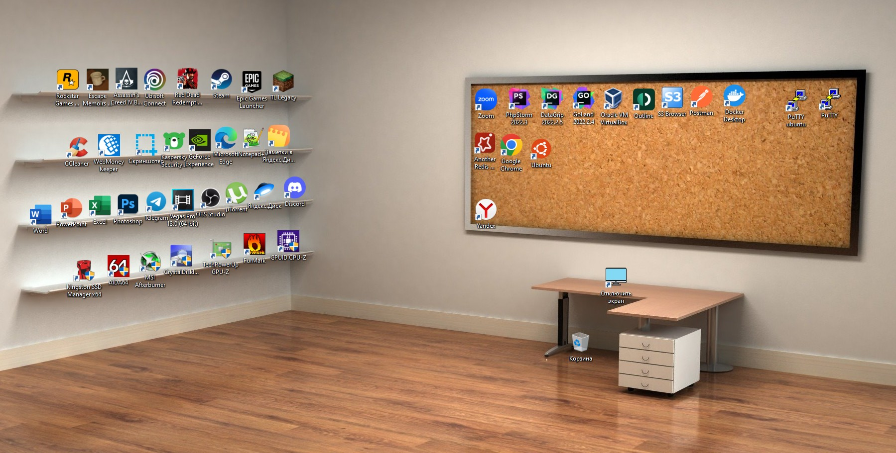
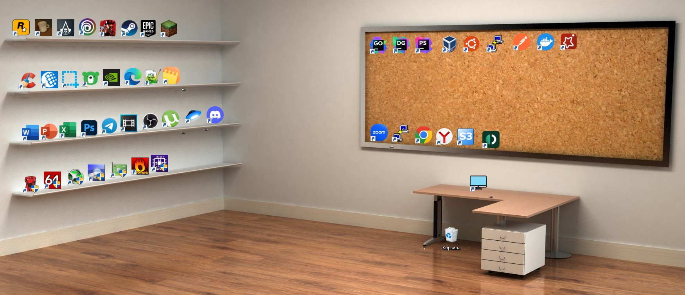
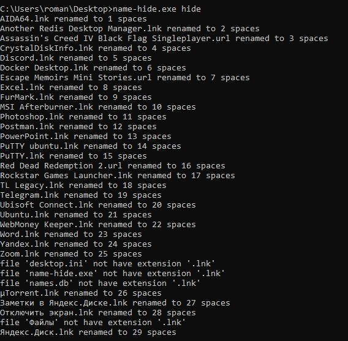
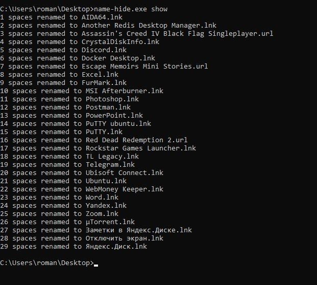

Внимание! После перезагрузки могут пропасть иконки ярлыков. Чтобы вернуть иконки, верните имена и снова перезагрузите ПК.

# Скрытие имен ярлыков рабочего стола
Программа заменяет имена ярлыков в папке на пробелы, чтобы скрыть названия. Произведенные замены сохраняет в папку с ярлыками в файл names.db.

В любой момент можно откатить переименования. Сам файл names.db можно сделать скрытым через средства Windows.

### Рабочий стол до:

### Рабочий стол после:

## Инструкция
Ярлыки рабочего стола пользователя тянутся из двух папок:
- C:\Users\%username%\Desktop - файлы текущего пользователя
- C:\Users\Public\Desktop - общие для всех пользователей файлы. Для правки файлов тут требуется запуск от имени администратора.

Заменить имена ярлыков, скорее всего, вам потребуется в обеих папках.

Программа работает через консоль:
- `name-hide.exe hide` - скрыть имена
- `name-hide.exe show` - показать имена

Можно указать параметр -path и путь до папки с ярлыками. По умолчанию используется папка откуда запущена программа.

### Скрываем имена

### Показываем имена

